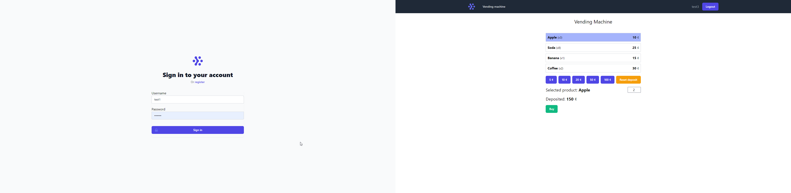
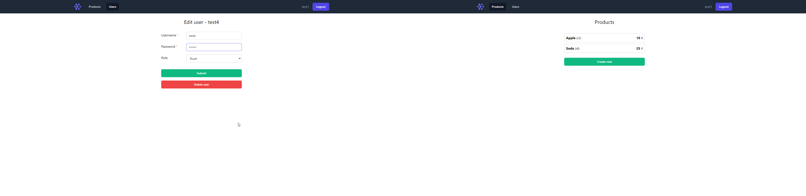

# Vending Machine

Project demonstrates working of a simple vending machine.





## Structure

This is a monorepo containing both frontend and backend code. Both packages are located in the `/packages` folder

### Frontend

Using [Next.js](https://nextjs.org/) and created with `create-next-app`. Tailwind added as a CSS library.

### Backend

Using [NestJS](https://nestjs.com/) and scaffolded with NestJS CLI.

Database used is Postgres and ORM is TypeORM.

## Development

After cloning repo, do:

```bash
npm install
```

This will run postinstall script and install dependencies in both packages.

> It's important to set `.env` file at the `packages/backend` folder (there is `.env.example` for reference).

### Start

Start Postgres container (via Docker Compose), backend and frontend dev servers with

```bash
npm run dev:backend:db
npm run dev:backend:server
npm run dev:frontend
```

Visit [localhost:3000](http://localhost:3000)

### VS Code

If you use VS Code as IDE there are tasks and extension set up for better dev flow.

## Testing

```bash
cd packages/backend
npm run test

```
